# Titanic Practice 

In this practice, the main goal is to go through the processes [[1](https://www.kaggle.com/startupsci/titanic-data-science-solutions)] [[2](https://www.kaggle.com/headsortails/pytanic)]of data analysis.

1. **Asumption** based on data
2. **Feature correlation** 
2. **Correct and complete** data (NAN or non-regular formation)
3. **Create** new features
4. Modeling with **cross-validation** to check parameters and which model is better
5. **classifying**
6. Iteration from 3

### Import package


```python
from sklearn import preprocessing 
from sklearn.model_selection import GridSearchCV 
from sklearn.ensemble import RandomForestClassifier 
from sklearn.ensemble import RandomForestRegressor

import warnings
warnings.filterwarnings("ignore")
import pandas as pd
import numpy as np
import matplotlib.pyplot as plt
import seaborn as sns

%matplotlib inline
pd.options.mode.chained_assignment = None
```


```python
## learning model
from sklearn.linear_model import LogisticRegression
from sklearn.svm import SVC, LinearSVC
from sklearn.ensemble import RandomForestClassifier
from sklearn.neighbors import KNeighborsClassifier
from sklearn.naive_bayes import GaussianNB
from sklearn.linear_model import Perceptron
from sklearn.linear_model import SGDClassifier
from sklearn.tree import DecisionTreeClassifier
from xgboost import XGBClassifier
from sklearn.metrics import precision_score
from sklearn.ensemble import GradientBoostingClassifier
from sklearn.model_selection import GridSearchCV, cross_val_score, StratifiedKFold, learning_curve
```

### Input data


```python
train = pd.read_csv("train.csv")
test = pd.read_csv("test.csv")
submit = pd.read_csv('gender_submission.csv')
```

### Check training and testing data are missing data or not


```python
train.head(5)
#check table formation
```


<div>
<style scoped>
    .dataframe tbody tr th:only-of-type {
        vertical-align: middle;
    }

    .dataframe tbody tr th {
        vertical-align: top;
    }

    .dataframe thead th {
        text-align: right;
    }
</style>
<table border="1" class="dataframe">
  <thead>
    <tr style="text-align: right;">
      <th></th>
      <th>PassengerId</th>
      <th>Survived</th>
      <th>Pclass</th>
      <th>Name</th>
      <th>Sex</th>
      <th>Age</th>
      <th>SibSp</th>
      <th>Parch</th>
      <th>Ticket</th>
      <th>Fare</th>
      <th>Cabin</th>
      <th>Embarked</th>
    </tr>
  </thead>
  <tbody>
    <tr>
      <th>0</th>
      <td>1</td>
      <td>0</td>
      <td>3</td>
      <td>Braund, Mr. Owen Harris</td>
      <td>male</td>
      <td>22.0</td>
      <td>1</td>
      <td>0</td>
      <td>A/5 21171</td>
      <td>7.2500</td>
      <td>NaN</td>
      <td>S</td>
    </tr>
    <tr>
      <th>1</th>
      <td>2</td>
      <td>1</td>
      <td>1</td>
      <td>Cumings, Mrs. John Bradley (Florence Briggs Th...</td>
      <td>female</td>
      <td>38.0</td>
      <td>1</td>
      <td>0</td>
      <td>PC 17599</td>
      <td>71.2833</td>
      <td>C85</td>
      <td>C</td>
    </tr>
    <tr>
      <th>2</th>
      <td>3</td>
      <td>1</td>
      <td>3</td>
      <td>Heikkinen, Miss. Laina</td>
      <td>female</td>
      <td>26.0</td>
      <td>0</td>
      <td>0</td>
      <td>STON/O2. 3101282</td>
      <td>7.9250</td>
      <td>NaN</td>
      <td>S</td>
    </tr>
    <tr>
      <th>3</th>
      <td>4</td>
      <td>1</td>
      <td>1</td>
      <td>Futrelle, Mrs. Jacques Heath (Lily May Peel)</td>
      <td>female</td>
      <td>35.0</td>
      <td>1</td>
      <td>0</td>
      <td>113803</td>
      <td>53.1000</td>
      <td>C123</td>
      <td>S</td>
    </tr>
    <tr>
      <th>4</th>
      <td>5</td>
      <td>0</td>
      <td>3</td>
      <td>Allen, Mr. William Henry</td>
      <td>male</td>
      <td>35.0</td>
      <td>0</td>
      <td>0</td>
      <td>373450</td>
      <td>8.0500</td>
      <td>NaN</td>
      <td>S</td>
    </tr>
  </tbody>
</table>
</div>


```python
train.info()
# check extist null or not
# we can see Age, Cabin, Embarked with some data missing
```

    <class 'pandas.core.frame.DataFrame'>
    RangeIndex: 891 entries, 0 to 890
    Data columns (total 12 columns):
    PassengerId    891 non-null int64
    Survived       891 non-null int64
    Pclass         891 non-null int64
    Name           891 non-null object
    Sex            891 non-null object
    Age            714 non-null float64
    SibSp          891 non-null int64
    Parch          891 non-null int64
    Ticket         891 non-null object
    Fare           891 non-null float64
    Cabin          204 non-null object
    Embarked       889 non-null object
    dtypes: float64(2), int64(5), object(5)
    memory usage: 83.6+ KB


```python
train.describe()
```


<div>
<style scoped>
    .dataframe tbody tr th:only-of-type {
        vertical-align: middle;
    }

    .dataframe tbody tr th {
        vertical-align: top;
    }

    .dataframe thead th {
        text-align: right;
    }
</style>
<table border="1" class="dataframe">
  <thead>
    <tr style="text-align: right;">
      <th></th>
      <th>PassengerId</th>
      <th>Survived</th>
      <th>Pclass</th>
      <th>Age</th>
      <th>SibSp</th>
      <th>Parch</th>
      <th>Fare</th>
    </tr>
  </thead>
  <tbody>
    <tr>
      <th>count</th>
      <td>891.000000</td>
      <td>891.000000</td>
      <td>891.000000</td>
      <td>714.000000</td>
      <td>891.000000</td>
      <td>891.000000</td>
      <td>891.000000</td>
    </tr>
    <tr>
      <th>mean</th>
      <td>446.000000</td>
      <td>0.383838</td>
      <td>2.308642</td>
      <td>29.699118</td>
      <td>0.523008</td>
      <td>0.381594</td>
      <td>32.204208</td>
    </tr>
    <tr>
      <th>std</th>
      <td>257.353842</td>
      <td>0.486592</td>
      <td>0.836071</td>
      <td>14.526497</td>
      <td>1.102743</td>
      <td>0.806057</td>
      <td>49.693429</td>
    </tr>
    <tr>
      <th>min</th>
      <td>1.000000</td>
      <td>0.000000</td>
      <td>1.000000</td>
      <td>0.420000</td>
      <td>0.000000</td>
      <td>0.000000</td>
      <td>0.000000</td>
    </tr>
    <tr>
      <th>25%</th>
      <td>223.500000</td>
      <td>0.000000</td>
      <td>2.000000</td>
      <td>20.125000</td>
      <td>0.000000</td>
      <td>0.000000</td>
      <td>7.910400</td>
    </tr>
    <tr>
      <th>50%</th>
      <td>446.000000</td>
      <td>0.000000</td>
      <td>3.000000</td>
      <td>28.000000</td>
      <td>0.000000</td>
      <td>0.000000</td>
      <td>14.454200</td>
    </tr>
    <tr>
      <th>75%</th>
      <td>668.500000</td>
      <td>1.000000</td>
      <td>3.000000</td>
      <td>38.000000</td>
      <td>1.000000</td>
      <td>0.000000</td>
      <td>31.000000</td>
    </tr>
    <tr>
      <th>max</th>
      <td>891.000000</td>
      <td>1.000000</td>
      <td>3.000000</td>
      <td>80.000000</td>
      <td>8.000000</td>
      <td>6.000000</td>
      <td>512.329200</td>
    </tr>
  </tbody>
</table>
</div>


### Append train and test data


```python
data = train.append(test)
data.reset_index(inplace=True, drop=True)
data.head(5)
```


<div>
<style scoped>
    .dataframe tbody tr th:only-of-type {
        vertical-align: middle;
    }

    .dataframe tbody tr th {
        vertical-align: top;
    }

    .dataframe thead th {
        text-align: right;
    }
</style>
<table border="1" class="dataframe">
  <thead>
    <tr style="text-align: right;">
      <th></th>
      <th>Age</th>
      <th>Cabin</th>
      <th>Embarked</th>
      <th>Fare</th>
      <th>Name</th>
      <th>Parch</th>
      <th>PassengerId</th>
      <th>Pclass</th>
      <th>Sex</th>
      <th>SibSp</th>
      <th>Survived</th>
      <th>Ticket</th>
    </tr>
  </thead>
  <tbody>
    <tr>
      <th>0</th>
      <td>22.0</td>
      <td>NaN</td>
      <td>S</td>
      <td>7.2500</td>
      <td>Braund, Mr. Owen Harris</td>
      <td>0</td>
      <td>1</td>
      <td>3</td>
      <td>male</td>
      <td>1</td>
      <td>0.0</td>
      <td>A/5 21171</td>
    </tr>
    <tr>
      <th>1</th>
      <td>38.0</td>
      <td>C85</td>
      <td>C</td>
      <td>71.2833</td>
      <td>Cumings, Mrs. John Bradley (Florence Briggs Th...</td>
      <td>0</td>
      <td>2</td>
      <td>1</td>
      <td>female</td>
      <td>1</td>
      <td>1.0</td>
      <td>PC 17599</td>
    </tr>
    <tr>
      <th>2</th>
      <td>26.0</td>
      <td>NaN</td>
      <td>S</td>
      <td>7.9250</td>
      <td>Heikkinen, Miss. Laina</td>
      <td>0</td>
      <td>3</td>
      <td>3</td>
      <td>female</td>
      <td>0</td>
      <td>1.0</td>
      <td>STON/O2. 3101282</td>
    </tr>
    <tr>
      <th>3</th>
      <td>35.0</td>
      <td>C123</td>
      <td>S</td>
      <td>53.1000</td>
      <td>Futrelle, Mrs. Jacques Heath (Lily May Peel)</td>
      <td>0</td>
      <td>4</td>
      <td>1</td>
      <td>female</td>
      <td>1</td>
      <td>1.0</td>
      <td>113803</td>
    </tr>
    <tr>
      <th>4</th>
      <td>35.0</td>
      <td>NaN</td>
      <td>S</td>
      <td>8.0500</td>
      <td>Allen, Mr. William Henry</td>
      <td>0</td>
      <td>5</td>
      <td>3</td>
      <td>male</td>
      <td>0</td>
      <td>0.0</td>
      <td>373450</td>
    </tr>
  </tbody>
</table>
</div>


## Anaylize data to know the relationship between survivals and other factors

### According to the figure downbelow, we can roughly assume
* Fare is related with Survived **the most**
* Pclass might be **the least** important factor with survived.


```python
f, ax = plt.subplots(figsize=(10,6))
train_corr = train.drop('PassengerId',axis=1).corr()
sns.heatmap(train_corr, ax=ax, vmax=.9, square=True)
```


    <matplotlib.axes._subplots.AxesSubplot at 0x1a23a39390>


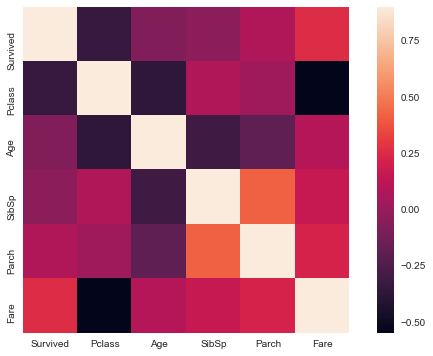


### Assume Female has higher survival rate


```python
sns.countplot(data['Sex'], hue=data['Survived'])
```


    <matplotlib.axes._subplots.AxesSubplot at 0x112e57d68>


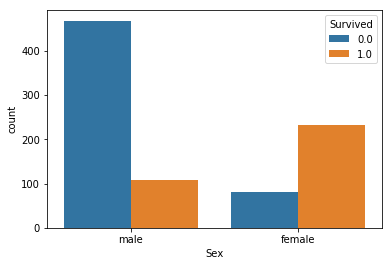


### Assume people with higher class tickets have higher survival rate


```python
sns.countplot(data['Pclass'], hue=data['Survived'])
```


    <matplotlib.axes._subplots.AxesSubplot at 0x112e9b6d8>


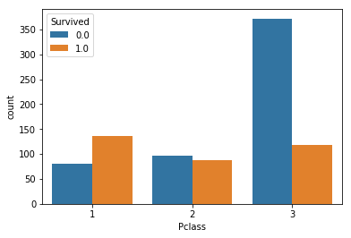


### Assume people leave from emabarked C with higher survival rate


```python
sns.countplot(data['Embarked'], hue=data['Survived'])
```


    <matplotlib.axes._subplots.AxesSubplot at 0x112f86400>


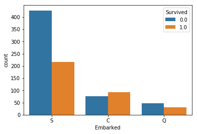


### Assume people **under 10 years olde** have higher survival rate


```python
f, axes = plt.subplots(1,1,figsize=(8,6))
sns.set_style('white')
ax1 = axes
ax1.set_title('Age survived distribution')
k1 = sns.distplot(data[data.Survived==0].Age.fillna(-20), hist=True,kde=False, color='r', ax=ax1, label='dead')
k2 = sns.distplot(data[data.Survived==1].Age.fillna(-20), hist=True,kde=False, color='g', ax=ax1, label='alive')
plt.legend()
ax1.set_xlabel('')
```


    Text(0.5,0,'')


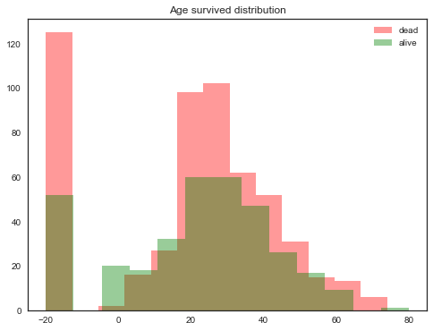


### Assume people with high Fare have higher survival rate


```python
f, axes = plt.subplots(1,1,figsize=(8,6))
sns.set_style('white')
ax1 = axes
ax1.set_title('Fare distribution')
k1 = sns.distplot(data[data.Survived==0].Fare.fillna(-20), hist=True,kde=False, color='r', ax=ax1, label='dead')
k2 = sns.distplot(data[data.Survived==1].Fare.fillna(-20), hist=True,kde=False, color='g', ax=ax1, label='alive')
plt.legend()
ax1.set_xlabel('')
```


    Text(0.5,0,'')


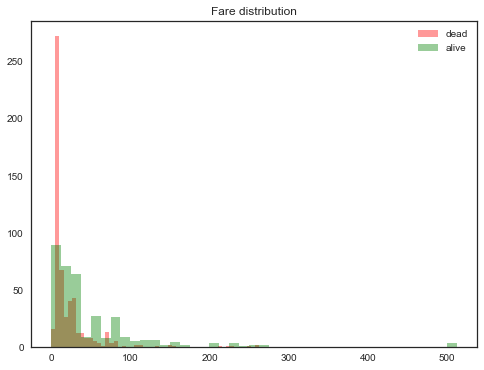


```python
f, axes = plt.subplots(1,1,figsize=(8,6))
sns.set_style('white')
ax1 = axes
ax1.set_title('Parch distribution')
k1 = sns.distplot(data[data.Survived==0].Parch.fillna(-20), hist=True,kde=False, color='r', ax=ax1, label='dead')
k2 = sns.distplot(data[data.Survived==1].Parch.fillna(-20), hist=True,kde=False, color='g', ax=ax1, label='alive')
plt.legend()
ax1.set_xlabel('')
```


    Text(0.5,0,'')


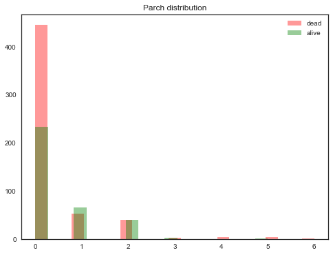


```python
f, axes = plt.subplots(1,1,figsize=(8,6))
sns.set_style('white')
ax1 = axes
ax1.set_title('SibSp distribution')
k1 = sns.distplot(data[data.Survived==0].SibSp.fillna(-20), hist=True,kde=False, color='r', ax=ax1, label='dead')
k2 = sns.distplot(data[data.Survived==1].SibSp.fillna(-20), hist=True,kde=False, color='g', ax=ax1, label='alive')
plt.legend()
ax1.set_xlabel('')

```


    Text(0.5,0,'')


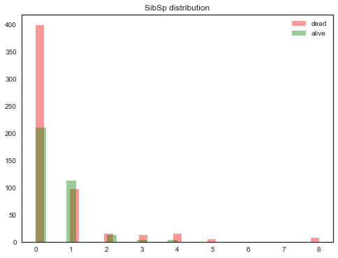


### Assume people have families with higher survival rate


```python
data['Family_Size'] = data['Parch'] + data['SibSp']

f, axes = plt.subplots(1,1,figsize=(8,6))
sns.set_style('white')
ax1 = axes
ax1.set_title('Family_Size distribution')
k1 = sns.distplot(data[data.Survived==0].Family_Size.fillna(-20), hist=True,kde=False, color='r', ax=ax1, label='dead')
k2 = sns.distplot(data[data.Survived==1].Family_Size.fillna(-20), hist=True,kde=False, color='g', ax=ax1, label='alive')
plt.legend()
ax1.set_xlabel('')
```


    Text(0.5,0,'')


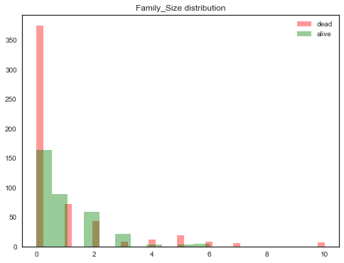


> ## Based on the observation above, We have the following assumptions that people with higher survival rate:
> * More women are resecued.  
> * Departure from embarked C
> * Age under 10 years old.
> * Higher class
> * Higher fare
> * Have 1 to 3 families

## Create new Features
### Analyze names


```python
data['LastName'] = data['Name'].str.split(", ", expand=True)[1]
data['Name'].str.split(", ",expand=True).head(5)
```


<div>
<style scoped>
    .dataframe tbody tr th:only-of-type {
        vertical-align: middle;
    }

    .dataframe tbody tr th {
        vertical-align: top;
    }

    .dataframe thead th {
        text-align: right;
    }
</style>
<table border="1" class="dataframe">
  <thead>
    <tr style="text-align: right;">
      <th></th>
      <th>0</th>
      <th>1</th>
    </tr>
  </thead>
  <tbody>
    <tr>
      <th>0</th>
      <td>Braund</td>
      <td>Mr. Owen Harris</td>
    </tr>
    <tr>
      <th>1</th>
      <td>Cumings</td>
      <td>Mrs. John Bradley (Florence Briggs Thayer)</td>
    </tr>
    <tr>
      <th>2</th>
      <td>Heikkinen</td>
      <td>Miss. Laina</td>
    </tr>
    <tr>
      <th>3</th>
      <td>Futrelle</td>
      <td>Mrs. Jacques Heath (Lily May Peel)</td>
    </tr>
    <tr>
      <th>4</th>
      <td>Allen</td>
      <td>Mr. William Henry</td>
    </tr>
  </tbody>
</table>
</div>


```python
data["Title"] = data['LastName'].str.split(". ",expand=True)[0]
data['Title'].unique()
```


    array(['Mr', 'Mrs', 'Miss', 'Master', 'Don', 'Rev', 'Dr', 'Mme', 'Ms',
           'Major', 'Lady', 'Sir', 'Mlle', 'Col', 'Capt', 'th', 'Jonkheer',
           'Dona'], dtype=object)


```python
pd.crosstab(data['Title'],data['Sex']).T.style.background_gradient(cmap='summer_r')
```


<style  type="text/css" >
    #T_96e22d82_c0b8_11e8_bbae_086d41d206d2row0_col0 {
            background-color:  #ffff66;
        }    #T_96e22d82_c0b8_11e8_bbae_086d41d206d2row0_col1 {
            background-color:  #ffff66;
        }    #T_96e22d82_c0b8_11e8_bbae_086d41d206d2row0_col2 {
            background-color:  #ffff66;
        }    #T_96e22d82_c0b8_11e8_bbae_086d41d206d2row0_col3 {
            background-color:  #008066;
        }    #T_96e22d82_c0b8_11e8_bbae_086d41d206d2row0_col4 {
            background-color:  #ffff66;
        }    #T_96e22d82_c0b8_11e8_bbae_086d41d206d2row0_col5 {
            background-color:  #ffff66;
        }    #T_96e22d82_c0b8_11e8_bbae_086d41d206d2row0_col6 {
            background-color:  #008066;
        }    #T_96e22d82_c0b8_11e8_bbae_086d41d206d2row0_col7 {
            background-color:  #ffff66;
        }    #T_96e22d82_c0b8_11e8_bbae_086d41d206d2row0_col8 {
            background-color:  #ffff66;
        }    #T_96e22d82_c0b8_11e8_bbae_086d41d206d2row0_col9 {
            background-color:  #008066;
        }    #T_96e22d82_c0b8_11e8_bbae_086d41d206d2row0_col10 {
            background-color:  #008066;
        }    #T_96e22d82_c0b8_11e8_bbae_086d41d206d2row0_col11 {
            background-color:  #008066;
        }    #T_96e22d82_c0b8_11e8_bbae_086d41d206d2row0_col12 {
            background-color:  #ffff66;
        }    #T_96e22d82_c0b8_11e8_bbae_086d41d206d2row0_col13 {
            background-color:  #008066;
        }    #T_96e22d82_c0b8_11e8_bbae_086d41d206d2row0_col14 {
            background-color:  #008066;
        }    #T_96e22d82_c0b8_11e8_bbae_086d41d206d2row0_col15 {
            background-color:  #ffff66;
        }    #T_96e22d82_c0b8_11e8_bbae_086d41d206d2row0_col16 {
            background-color:  #ffff66;
        }    #T_96e22d82_c0b8_11e8_bbae_086d41d206d2row0_col17 {
            background-color:  #008066;
        }    #T_96e22d82_c0b8_11e8_bbae_086d41d206d2row1_col0 {
            background-color:  #008066;
        }    #T_96e22d82_c0b8_11e8_bbae_086d41d206d2row1_col1 {
            background-color:  #008066;
        }    #T_96e22d82_c0b8_11e8_bbae_086d41d206d2row1_col2 {
            background-color:  #008066;
        }    #T_96e22d82_c0b8_11e8_bbae_086d41d206d2row1_col3 {
            background-color:  #ffff66;
        }    #T_96e22d82_c0b8_11e8_bbae_086d41d206d2row1_col4 {
            background-color:  #008066;
        }    #T_96e22d82_c0b8_11e8_bbae_086d41d206d2row1_col5 {
            background-color:  #008066;
        }    #T_96e22d82_c0b8_11e8_bbae_086d41d206d2row1_col6 {
            background-color:  #ffff66;
        }    #T_96e22d82_c0b8_11e8_bbae_086d41d206d2row1_col7 {
            background-color:  #008066;
        }    #T_96e22d82_c0b8_11e8_bbae_086d41d206d2row1_col8 {
            background-color:  #008066;
        }    #T_96e22d82_c0b8_11e8_bbae_086d41d206d2row1_col9 {
            background-color:  #ffff66;
        }    #T_96e22d82_c0b8_11e8_bbae_086d41d206d2row1_col10 {
            background-color:  #ffff66;
        }    #T_96e22d82_c0b8_11e8_bbae_086d41d206d2row1_col11 {
            background-color:  #ffff66;
        }    #T_96e22d82_c0b8_11e8_bbae_086d41d206d2row1_col12 {
            background-color:  #008066;
        }    #T_96e22d82_c0b8_11e8_bbae_086d41d206d2row1_col13 {
            background-color:  #ffff66;
        }    #T_96e22d82_c0b8_11e8_bbae_086d41d206d2row1_col14 {
            background-color:  #ffff66;
        }    #T_96e22d82_c0b8_11e8_bbae_086d41d206d2row1_col15 {
            background-color:  #008066;
        }    #T_96e22d82_c0b8_11e8_bbae_086d41d206d2row1_col16 {
            background-color:  #008066;
        }    #T_96e22d82_c0b8_11e8_bbae_086d41d206d2row1_col17 {
            background-color:  #ffff66;
        }</style>  
<table id="T_96e22d82_c0b8_11e8_bbae_086d41d206d2" > 
<thead>    <tr> 
        <th class="index_name level0" >Title</th> 
        <th class="col_heading level0 col0" >Capt</th> 
        <th class="col_heading level0 col1" >Col</th> 
        <th class="col_heading level0 col2" >Don</th> 
        <th class="col_heading level0 col3" >Dona</th> 
        <th class="col_heading level0 col4" >Dr</th> 
        <th class="col_heading level0 col5" >Jonkheer</th> 
        <th class="col_heading level0 col6" >Lady</th> 
        <th class="col_heading level0 col7" >Major</th> 
        <th class="col_heading level0 col8" >Master</th> 
        <th class="col_heading level0 col9" >Miss</th> 
        <th class="col_heading level0 col10" >Mlle</th> 
        <th class="col_heading level0 col11" >Mme</th> 
        <th class="col_heading level0 col12" >Mr</th> 
        <th class="col_heading level0 col13" >Mrs</th> 
        <th class="col_heading level0 col14" >Ms</th> 
        <th class="col_heading level0 col15" >Rev</th> 
        <th class="col_heading level0 col16" >Sir</th> 
        <th class="col_heading level0 col17" >th</th> 
    </tr>    <tr> 
        <th class="index_name level0" >Sex</th> 
        <th class="blank" ></th> 
        <th class="blank" ></th> 
        <th class="blank" ></th> 
        <th class="blank" ></th> 
        <th class="blank" ></th> 
        <th class="blank" ></th> 
        <th class="blank" ></th> 
        <th class="blank" ></th> 
        <th class="blank" ></th> 
        <th class="blank" ></th> 
        <th class="blank" ></th> 
        <th class="blank" ></th> 
        <th class="blank" ></th> 
        <th class="blank" ></th> 
        <th class="blank" ></th> 
        <th class="blank" ></th> 
        <th class="blank" ></th> 
        <th class="blank" ></th> 
    </tr></thead> 
<tbody>    <tr> 
        <th id="T_96e22d82_c0b8_11e8_bbae_086d41d206d2level0_row0" class="row_heading level0 row0" >0</th> 
        <td id="T_96e22d82_c0b8_11e8_bbae_086d41d206d2row0_col0" class="data row0 col0" >0</td> 
        <td id="T_96e22d82_c0b8_11e8_bbae_086d41d206d2row0_col1" class="data row0 col1" >0</td> 
        <td id="T_96e22d82_c0b8_11e8_bbae_086d41d206d2row0_col2" class="data row0 col2" >0</td> 
        <td id="T_96e22d82_c0b8_11e8_bbae_086d41d206d2row0_col3" class="data row0 col3" >1</td> 
        <td id="T_96e22d82_c0b8_11e8_bbae_086d41d206d2row0_col4" class="data row0 col4" >1</td> 
        <td id="T_96e22d82_c0b8_11e8_bbae_086d41d206d2row0_col5" class="data row0 col5" >0</td> 
        <td id="T_96e22d82_c0b8_11e8_bbae_086d41d206d2row0_col6" class="data row0 col6" >1</td> 
        <td id="T_96e22d82_c0b8_11e8_bbae_086d41d206d2row0_col7" class="data row0 col7" >0</td> 
        <td id="T_96e22d82_c0b8_11e8_bbae_086d41d206d2row0_col8" class="data row0 col8" >0</td> 
        <td id="T_96e22d82_c0b8_11e8_bbae_086d41d206d2row0_col9" class="data row0 col9" >260</td> 
        <td id="T_96e22d82_c0b8_11e8_bbae_086d41d206d2row0_col10" class="data row0 col10" >2</td> 
        <td id="T_96e22d82_c0b8_11e8_bbae_086d41d206d2row0_col11" class="data row0 col11" >1</td> 
        <td id="T_96e22d82_c0b8_11e8_bbae_086d41d206d2row0_col12" class="data row0 col12" >0</td> 
        <td id="T_96e22d82_c0b8_11e8_bbae_086d41d206d2row0_col13" class="data row0 col13" >197</td> 
        <td id="T_96e22d82_c0b8_11e8_bbae_086d41d206d2row0_col14" class="data row0 col14" >2</td> 
        <td id="T_96e22d82_c0b8_11e8_bbae_086d41d206d2row0_col15" class="data row0 col15" >0</td> 
        <td id="T_96e22d82_c0b8_11e8_bbae_086d41d206d2row0_col16" class="data row0 col16" >0</td> 
        <td id="T_96e22d82_c0b8_11e8_bbae_086d41d206d2row0_col17" class="data row0 col17" >1</td> 
    </tr>    <tr> 
        <th id="T_96e22d82_c0b8_11e8_bbae_086d41d206d2level0_row1" class="row_heading level0 row1" >1</th> 
        <td id="T_96e22d82_c0b8_11e8_bbae_086d41d206d2row1_col0" class="data row1 col0" >1</td> 
        <td id="T_96e22d82_c0b8_11e8_bbae_086d41d206d2row1_col1" class="data row1 col1" >4</td> 
        <td id="T_96e22d82_c0b8_11e8_bbae_086d41d206d2row1_col2" class="data row1 col2" >1</td> 
        <td id="T_96e22d82_c0b8_11e8_bbae_086d41d206d2row1_col3" class="data row1 col3" >0</td> 
        <td id="T_96e22d82_c0b8_11e8_bbae_086d41d206d2row1_col4" class="data row1 col4" >7</td> 
        <td id="T_96e22d82_c0b8_11e8_bbae_086d41d206d2row1_col5" class="data row1 col5" >1</td> 
        <td id="T_96e22d82_c0b8_11e8_bbae_086d41d206d2row1_col6" class="data row1 col6" >0</td> 
        <td id="T_96e22d82_c0b8_11e8_bbae_086d41d206d2row1_col7" class="data row1 col7" >2</td> 
        <td id="T_96e22d82_c0b8_11e8_bbae_086d41d206d2row1_col8" class="data row1 col8" >61</td> 
        <td id="T_96e22d82_c0b8_11e8_bbae_086d41d206d2row1_col9" class="data row1 col9" >0</td> 
        <td id="T_96e22d82_c0b8_11e8_bbae_086d41d206d2row1_col10" class="data row1 col10" >0</td> 
        <td id="T_96e22d82_c0b8_11e8_bbae_086d41d206d2row1_col11" class="data row1 col11" >0</td> 
        <td id="T_96e22d82_c0b8_11e8_bbae_086d41d206d2row1_col12" class="data row1 col12" >757</td> 
        <td id="T_96e22d82_c0b8_11e8_bbae_086d41d206d2row1_col13" class="data row1 col13" >0</td> 
        <td id="T_96e22d82_c0b8_11e8_bbae_086d41d206d2row1_col14" class="data row1 col14" >0</td> 
        <td id="T_96e22d82_c0b8_11e8_bbae_086d41d206d2row1_col15" class="data row1 col15" >8</td> 
        <td id="T_96e22d82_c0b8_11e8_bbae_086d41d206d2row1_col16" class="data row1 col16" >1</td> 
        <td id="T_96e22d82_c0b8_11e8_bbae_086d41d206d2row1_col17" class="data row1 col17" >0</td> 
    </tr></tbody> 
</table> 


```python
pd.crosstab(data['Title'],data['Survived']).T.style.background_gradient(cmap='summer_r')
```


<style  type="text/css" >
    #T_9762bb9e_c0b8_11e8_841b_086d41d206d2row0_col0 {
            background-color:  #008066;
        }    #T_9762bb9e_c0b8_11e8_841b_086d41d206d2row0_col1 {
            background-color:  #ffff66;
        }    #T_9762bb9e_c0b8_11e8_841b_086d41d206d2row0_col2 {
            background-color:  #008066;
        }    #T_9762bb9e_c0b8_11e8_841b_086d41d206d2row0_col3 {
            background-color:  #008066;
        }    #T_9762bb9e_c0b8_11e8_841b_086d41d206d2row0_col4 {
            background-color:  #008066;
        }    #T_9762bb9e_c0b8_11e8_841b_086d41d206d2row0_col5 {
            background-color:  #ffff66;
        }    #T_9762bb9e_c0b8_11e8_841b_086d41d206d2row0_col6 {
            background-color:  #ffff66;
        }    #T_9762bb9e_c0b8_11e8_841b_086d41d206d2row0_col7 {
            background-color:  #ffff66;
        }    #T_9762bb9e_c0b8_11e8_841b_086d41d206d2row0_col8 {
            background-color:  #ffff66;
        }    #T_9762bb9e_c0b8_11e8_841b_086d41d206d2row0_col9 {
            background-color:  #ffff66;
        }    #T_9762bb9e_c0b8_11e8_841b_086d41d206d2row0_col10 {
            background-color:  #ffff66;
        }    #T_9762bb9e_c0b8_11e8_841b_086d41d206d2row0_col11 {
            background-color:  #008066;
        }    #T_9762bb9e_c0b8_11e8_841b_086d41d206d2row0_col12 {
            background-color:  #ffff66;
        }    #T_9762bb9e_c0b8_11e8_841b_086d41d206d2row0_col13 {
            background-color:  #ffff66;
        }    #T_9762bb9e_c0b8_11e8_841b_086d41d206d2row0_col14 {
            background-color:  #008066;
        }    #T_9762bb9e_c0b8_11e8_841b_086d41d206d2row0_col15 {
            background-color:  #ffff66;
        }    #T_9762bb9e_c0b8_11e8_841b_086d41d206d2row0_col16 {
            background-color:  #ffff66;
        }    #T_9762bb9e_c0b8_11e8_841b_086d41d206d2row1_col0 {
            background-color:  #ffff66;
        }    #T_9762bb9e_c0b8_11e8_841b_086d41d206d2row1_col1 {
            background-color:  #ffff66;
        }    #T_9762bb9e_c0b8_11e8_841b_086d41d206d2row1_col2 {
            background-color:  #ffff66;
        }    #T_9762bb9e_c0b8_11e8_841b_086d41d206d2row1_col3 {
            background-color:  #ffff66;
        }    #T_9762bb9e_c0b8_11e8_841b_086d41d206d2row1_col4 {
            background-color:  #ffff66;
        }    #T_9762bb9e_c0b8_11e8_841b_086d41d206d2row1_col5 {
            background-color:  #008066;
        }    #T_9762bb9e_c0b8_11e8_841b_086d41d206d2row1_col6 {
            background-color:  #ffff66;
        }    #T_9762bb9e_c0b8_11e8_841b_086d41d206d2row1_col7 {
            background-color:  #008066;
        }    #T_9762bb9e_c0b8_11e8_841b_086d41d206d2row1_col8 {
            background-color:  #008066;
        }    #T_9762bb9e_c0b8_11e8_841b_086d41d206d2row1_col9 {
            background-color:  #008066;
        }    #T_9762bb9e_c0b8_11e8_841b_086d41d206d2row1_col10 {
            background-color:  #008066;
        }    #T_9762bb9e_c0b8_11e8_841b_086d41d206d2row1_col11 {
            background-color:  #ffff66;
        }    #T_9762bb9e_c0b8_11e8_841b_086d41d206d2row1_col12 {
            background-color:  #008066;
        }    #T_9762bb9e_c0b8_11e8_841b_086d41d206d2row1_col13 {
            background-color:  #008066;
        }    #T_9762bb9e_c0b8_11e8_841b_086d41d206d2row1_col14 {
            background-color:  #ffff66;
        }    #T_9762bb9e_c0b8_11e8_841b_086d41d206d2row1_col15 {
            background-color:  #008066;
        }    #T_9762bb9e_c0b8_11e8_841b_086d41d206d2row1_col16 {
            background-color:  #008066;
        }</style>  
<table id="T_9762bb9e_c0b8_11e8_841b_086d41d206d2" > 
<thead>    <tr> 
        <th class="index_name level0" >Title</th> 
        <th class="col_heading level0 col0" >Capt</th> 
        <th class="col_heading level0 col1" >Col</th> 
        <th class="col_heading level0 col2" >Don</th> 
        <th class="col_heading level0 col3" >Dr</th> 
        <th class="col_heading level0 col4" >Jonkheer</th> 
        <th class="col_heading level0 col5" >Lady</th> 
        <th class="col_heading level0 col6" >Major</th> 
        <th class="col_heading level0 col7" >Master</th> 
        <th class="col_heading level0 col8" >Miss</th> 
        <th class="col_heading level0 col9" >Mlle</th> 
        <th class="col_heading level0 col10" >Mme</th> 
        <th class="col_heading level0 col11" >Mr</th> 
        <th class="col_heading level0 col12" >Mrs</th> 
        <th class="col_heading level0 col13" >Ms</th> 
        <th class="col_heading level0 col14" >Rev</th> 
        <th class="col_heading level0 col15" >Sir</th> 
        <th class="col_heading level0 col16" >th</th> 
    </tr>    <tr> 
        <th class="index_name level0" >Survived</th> 
        <th class="blank" ></th> 
        <th class="blank" ></th> 
        <th class="blank" ></th> 
        <th class="blank" ></th> 
        <th class="blank" ></th> 
        <th class="blank" ></th> 
        <th class="blank" ></th> 
        <th class="blank" ></th> 
        <th class="blank" ></th> 
        <th class="blank" ></th> 
        <th class="blank" ></th> 
        <th class="blank" ></th> 
        <th class="blank" ></th> 
        <th class="blank" ></th> 
        <th class="blank" ></th> 
        <th class="blank" ></th> 
        <th class="blank" ></th> 
    </tr></thead> 
<tbody>    <tr> 
        <th id="T_9762bb9e_c0b8_11e8_841b_086d41d206d2level0_row0" class="row_heading level0 row0" >0.0</th> 
        <td id="T_9762bb9e_c0b8_11e8_841b_086d41d206d2row0_col0" class="data row0 col0" >1</td> 
        <td id="T_9762bb9e_c0b8_11e8_841b_086d41d206d2row0_col1" class="data row0 col1" >1</td> 
        <td id="T_9762bb9e_c0b8_11e8_841b_086d41d206d2row0_col2" class="data row0 col2" >1</td> 
        <td id="T_9762bb9e_c0b8_11e8_841b_086d41d206d2row0_col3" class="data row0 col3" >4</td> 
        <td id="T_9762bb9e_c0b8_11e8_841b_086d41d206d2row0_col4" class="data row0 col4" >1</td> 
        <td id="T_9762bb9e_c0b8_11e8_841b_086d41d206d2row0_col5" class="data row0 col5" >0</td> 
        <td id="T_9762bb9e_c0b8_11e8_841b_086d41d206d2row0_col6" class="data row0 col6" >1</td> 
        <td id="T_9762bb9e_c0b8_11e8_841b_086d41d206d2row0_col7" class="data row0 col7" >17</td> 
        <td id="T_9762bb9e_c0b8_11e8_841b_086d41d206d2row0_col8" class="data row0 col8" >55</td> 
        <td id="T_9762bb9e_c0b8_11e8_841b_086d41d206d2row0_col9" class="data row0 col9" >0</td> 
        <td id="T_9762bb9e_c0b8_11e8_841b_086d41d206d2row0_col10" class="data row0 col10" >0</td> 
        <td id="T_9762bb9e_c0b8_11e8_841b_086d41d206d2row0_col11" class="data row0 col11" >436</td> 
        <td id="T_9762bb9e_c0b8_11e8_841b_086d41d206d2row0_col12" class="data row0 col12" >26</td> 
        <td id="T_9762bb9e_c0b8_11e8_841b_086d41d206d2row0_col13" class="data row0 col13" >0</td> 
        <td id="T_9762bb9e_c0b8_11e8_841b_086d41d206d2row0_col14" class="data row0 col14" >6</td> 
        <td id="T_9762bb9e_c0b8_11e8_841b_086d41d206d2row0_col15" class="data row0 col15" >0</td> 
        <td id="T_9762bb9e_c0b8_11e8_841b_086d41d206d2row0_col16" class="data row0 col16" >0</td> 
    </tr>    <tr> 
        <th id="T_9762bb9e_c0b8_11e8_841b_086d41d206d2level0_row1" class="row_heading level0 row1" >1.0</th> 
        <td id="T_9762bb9e_c0b8_11e8_841b_086d41d206d2row1_col0" class="data row1 col0" >0</td> 
        <td id="T_9762bb9e_c0b8_11e8_841b_086d41d206d2row1_col1" class="data row1 col1" >1</td> 
        <td id="T_9762bb9e_c0b8_11e8_841b_086d41d206d2row1_col2" class="data row1 col2" >0</td> 
        <td id="T_9762bb9e_c0b8_11e8_841b_086d41d206d2row1_col3" class="data row1 col3" >3</td> 
        <td id="T_9762bb9e_c0b8_11e8_841b_086d41d206d2row1_col4" class="data row1 col4" >0</td> 
        <td id="T_9762bb9e_c0b8_11e8_841b_086d41d206d2row1_col5" class="data row1 col5" >1</td> 
        <td id="T_9762bb9e_c0b8_11e8_841b_086d41d206d2row1_col6" class="data row1 col6" >1</td> 
        <td id="T_9762bb9e_c0b8_11e8_841b_086d41d206d2row1_col7" class="data row1 col7" >23</td> 
        <td id="T_9762bb9e_c0b8_11e8_841b_086d41d206d2row1_col8" class="data row1 col8" >127</td> 
        <td id="T_9762bb9e_c0b8_11e8_841b_086d41d206d2row1_col9" class="data row1 col9" >2</td> 
        <td id="T_9762bb9e_c0b8_11e8_841b_086d41d206d2row1_col10" class="data row1 col10" >1</td> 
        <td id="T_9762bb9e_c0b8_11e8_841b_086d41d206d2row1_col11" class="data row1 col11" >81</td> 
        <td id="T_9762bb9e_c0b8_11e8_841b_086d41d206d2row1_col12" class="data row1 col12" >99</td> 
        <td id="T_9762bb9e_c0b8_11e8_841b_086d41d206d2row1_col13" class="data row1 col13" >1</td> 
        <td id="T_9762bb9e_c0b8_11e8_841b_086d41d206d2row1_col14" class="data row1 col14" >0</td> 
        <td id="T_9762bb9e_c0b8_11e8_841b_086d41d206d2row1_col15" class="data row1 col15" >1</td> 
        <td id="T_9762bb9e_c0b8_11e8_841b_086d41d206d2row1_col16" class="data row1 col16" >1</td> 
    </tr></tbody> 
</table> 


```python
data.head(5)
```


<div>
<style scoped>
    .dataframe tbody tr th:only-of-type {
        vertical-align: middle;
    }

    .dataframe tbody tr th {
        vertical-align: top;
    }

    .dataframe thead th {
        text-align: right;
    }
</style>
<table border="1" class="dataframe">
  <thead>
    <tr style="text-align: right;">
      <th></th>
      <th>Age</th>
      <th>Cabin</th>
      <th>Embarked</th>
      <th>Fare</th>
      <th>Name</th>
      <th>Parch</th>
      <th>PassengerId</th>
      <th>Pclass</th>
      <th>Sex</th>
      <th>SibSp</th>
      <th>Survived</th>
      <th>Ticket</th>
      <th>Family_Size</th>
      <th>Name_Len</th>
      <th>LastName</th>
      <th>Title</th>
    </tr>
  </thead>
  <tbody>
    <tr>
      <th>0</th>
      <td>22.0</td>
      <td>NaN</td>
      <td>2</td>
      <td>7.2500</td>
      <td>Braund, Mr. Owen Harris</td>
      <td>0</td>
      <td>1</td>
      <td>2</td>
      <td>1</td>
      <td>1</td>
      <td>0.0</td>
      <td>A/5 21171</td>
      <td>1</td>
      <td>23</td>
      <td>Mr. Owen Harris</td>
      <td>Mr</td>
    </tr>
    <tr>
      <th>1</th>
      <td>38.0</td>
      <td>C85</td>
      <td>0</td>
      <td>71.2833</td>
      <td>Cumings, Mrs. John Bradley (Florence Briggs Th...</td>
      <td>0</td>
      <td>2</td>
      <td>0</td>
      <td>0</td>
      <td>1</td>
      <td>1.0</td>
      <td>PC 17599</td>
      <td>1</td>
      <td>51</td>
      <td>Mrs. John Bradley (Florence Briggs Thayer)</td>
      <td>Mrs</td>
    </tr>
    <tr>
      <th>2</th>
      <td>26.0</td>
      <td>NaN</td>
      <td>2</td>
      <td>7.9250</td>
      <td>Heikkinen, Miss. Laina</td>
      <td>0</td>
      <td>3</td>
      <td>2</td>
      <td>0</td>
      <td>0</td>
      <td>1.0</td>
      <td>STON/O2. 3101282</td>
      <td>0</td>
      <td>22</td>
      <td>Miss. Laina</td>
      <td>Miss</td>
    </tr>
    <tr>
      <th>3</th>
      <td>35.0</td>
      <td>C123</td>
      <td>2</td>
      <td>53.1000</td>
      <td>Futrelle, Mrs. Jacques Heath (Lily May Peel)</td>
      <td>0</td>
      <td>4</td>
      <td>0</td>
      <td>0</td>
      <td>1</td>
      <td>1.0</td>
      <td>113803</td>
      <td>1</td>
      <td>44</td>
      <td>Mrs. Jacques Heath (Lily May Peel)</td>
      <td>Mrs</td>
    </tr>
    <tr>
      <th>4</th>
      <td>35.0</td>
      <td>NaN</td>
      <td>2</td>
      <td>8.0500</td>
      <td>Allen, Mr. William Henry</td>
      <td>0</td>
      <td>5</td>
      <td>2</td>
      <td>1</td>
      <td>0</td>
      <td>0.0</td>
      <td>373450</td>
      <td>0</td>
      <td>24</td>
      <td>Mr. William Henry</td>
      <td>Mr</td>
    </tr>
  </tbody>
</table>
</div>


```python
data.groupby(['Title'])['Age'].mean()
```


    Title
    Capt        70.000000
    Col         54.000000
    Don         40.000000
    Dona        39.000000
    Dr          43.571429
    Jonkheer    38.000000
    Lady        48.000000
    Major       48.500000
    Master       5.482642
    Miss        21.774238
    Mlle        24.000000
    Mme         24.000000
    Mr          32.252151
    Mrs         36.994118
    Ms          28.000000
    Rev         41.250000
    Sir         49.000000
    th          33.000000
    Name: Age, dtype: float64


## Create a new feature Title2


```python
data['Title2'] = data['Title'].replace(['Mlle','Mme','Ms','Dr','Major','Lady','the Countess','Jonkheer','Col','Rev','Capt','Sir','Don','Dona','th'],
         ['Miss','Mrs','Miss','Mr','Mr','Mrs','Mrs','Mr','Mr','Mr','Mr','Mr','Mr','Mrs','Miss'])
data['Title2'].unique()
```


    array(['Mr', 'Mrs', 'Miss', 'Master'], dtype=object)


```python
data.groupby('Title2')['Age'].mean()
```


    Title2
    Master     5.482642
    Miss      21.876589
    Mr        32.811056
    Mrs       36.994220
    Name: Age, dtype: float64


```python
data.groupby(['Title2','Pclass'])['Age'].mean()
```


    Title2  Pclass
    Master  0          6.984000
            1          2.757273
            2          6.090000
    Miss    0         30.177419
            1         20.865714
            2         17.360874
    Mr      0         42.241497
            1         32.914966
            2         28.318910
    Mrs     0         42.942857
            1         33.518519
            2         32.326531
    Name: Age, dtype: float64


```python
pd.crosstab(data['Title2'],data['Sex']).T.style.background_gradient(cmap='summer_r')
```


<style  type="text/css" >
    #T_9b14f6e6_c0b8_11e8_9632_086d41d206d2row0_col0 {
            background-color:  #ffff66;
        }    #T_9b14f6e6_c0b8_11e8_9632_086d41d206d2row0_col1 {
            background-color:  #008066;
        }    #T_9b14f6e6_c0b8_11e8_9632_086d41d206d2row0_col2 {
            background-color:  #ffff66;
        }    #T_9b14f6e6_c0b8_11e8_9632_086d41d206d2row0_col3 {
            background-color:  #008066;
        }    #T_9b14f6e6_c0b8_11e8_9632_086d41d206d2row1_col0 {
            background-color:  #008066;
        }    #T_9b14f6e6_c0b8_11e8_9632_086d41d206d2row1_col1 {
            background-color:  #ffff66;
        }    #T_9b14f6e6_c0b8_11e8_9632_086d41d206d2row1_col2 {
            background-color:  #008066;
        }    #T_9b14f6e6_c0b8_11e8_9632_086d41d206d2row1_col3 {
            background-color:  #ffff66;
        }</style>  
<table id="T_9b14f6e6_c0b8_11e8_9632_086d41d206d2" > 
<thead>    <tr> 
        <th class="index_name level0" >Title2</th> 
        <th class="col_heading level0 col0" >Master</th> 
        <th class="col_heading level0 col1" >Miss</th> 
        <th class="col_heading level0 col2" >Mr</th> 
        <th class="col_heading level0 col3" >Mrs</th> 
    </tr>    <tr> 
        <th class="index_name level0" >Sex</th> 
        <th class="blank" ></th> 
        <th class="blank" ></th> 
        <th class="blank" ></th> 
        <th class="blank" ></th> 
    </tr></thead> 
<tbody>    <tr> 
        <th id="T_9b14f6e6_c0b8_11e8_9632_086d41d206d2level0_row0" class="row_heading level0 row0" >0</th> 
        <td id="T_9b14f6e6_c0b8_11e8_9632_086d41d206d2row0_col0" class="data row0 col0" >0</td> 
        <td id="T_9b14f6e6_c0b8_11e8_9632_086d41d206d2row0_col1" class="data row0 col1" >265</td> 
        <td id="T_9b14f6e6_c0b8_11e8_9632_086d41d206d2row0_col2" class="data row0 col2" >1</td> 
        <td id="T_9b14f6e6_c0b8_11e8_9632_086d41d206d2row0_col3" class="data row0 col3" >200</td> 
    </tr>    <tr> 
        <th id="T_9b14f6e6_c0b8_11e8_9632_086d41d206d2level0_row1" class="row_heading level0 row1" >1</th> 
        <td id="T_9b14f6e6_c0b8_11e8_9632_086d41d206d2row1_col0" class="data row1 col0" >61</td> 
        <td id="T_9b14f6e6_c0b8_11e8_9632_086d41d206d2row1_col1" class="data row1 col1" >0</td> 
        <td id="T_9b14f6e6_c0b8_11e8_9632_086d41d206d2row1_col2" class="data row1 col2" >782</td> 
        <td id="T_9b14f6e6_c0b8_11e8_9632_086d41d206d2row1_col3" class="data row1 col3" >0</td> 
    </tr></tbody> 
</table> 


```python
pd.crosstab(data['Title2'],data['Survived']).T.style.background_gradient(cmap='summer_r') 
```


<style  type="text/css" >
    #T_9bb753c8_c0b8_11e8_b112_086d41d206d2row0_col0 {
            background-color:  #ffff66;
        }    #T_9bb753c8_c0b8_11e8_b112_086d41d206d2row0_col1 {
            background-color:  #ffff66;
        }    #T_9bb753c8_c0b8_11e8_b112_086d41d206d2row0_col2 {
            background-color:  #008066;
        }    #T_9bb753c8_c0b8_11e8_b112_086d41d206d2row0_col3 {
            background-color:  #ffff66;
        }    #T_9bb753c8_c0b8_11e8_b112_086d41d206d2row1_col0 {
            background-color:  #008066;
        }    #T_9bb753c8_c0b8_11e8_b112_086d41d206d2row1_col1 {
            background-color:  #008066;
        }    #T_9bb753c8_c0b8_11e8_b112_086d41d206d2row1_col2 {
            background-color:  #ffff66;
        }    #T_9bb753c8_c0b8_11e8_b112_086d41d206d2row1_col3 {
            background-color:  #008066;
        }</style>  
<table id="T_9bb753c8_c0b8_11e8_b112_086d41d206d2" > 
<thead>    <tr> 
        <th class="index_name level0" >Title2</th> 
        <th class="col_heading level0 col0" >Master</th> 
        <th class="col_heading level0 col1" >Miss</th> 
        <th class="col_heading level0 col2" >Mr</th> 
        <th class="col_heading level0 col3" >Mrs</th> 
    </tr>    <tr> 
        <th class="index_name level0" >Survived</th> 
        <th class="blank" ></th> 
        <th class="blank" ></th> 
        <th class="blank" ></th> 
        <th class="blank" ></th> 
    </tr></thead> 
<tbody>    <tr> 
        <th id="T_9bb753c8_c0b8_11e8_b112_086d41d206d2level0_row0" class="row_heading level0 row0" >0.0</th> 
        <td id="T_9bb753c8_c0b8_11e8_b112_086d41d206d2row0_col0" class="data row0 col0" >17</td> 
        <td id="T_9bb753c8_c0b8_11e8_b112_086d41d206d2row0_col1" class="data row0 col1" >55</td> 
        <td id="T_9bb753c8_c0b8_11e8_b112_086d41d206d2row0_col2" class="data row0 col2" >451</td> 
        <td id="T_9bb753c8_c0b8_11e8_b112_086d41d206d2row0_col3" class="data row0 col3" >26</td> 
    </tr>    <tr> 
        <th id="T_9bb753c8_c0b8_11e8_b112_086d41d206d2level0_row1" class="row_heading level0 row1" >1.0</th> 
        <td id="T_9bb753c8_c0b8_11e8_b112_086d41d206d2row1_col0" class="data row1 col0" >23</td> 
        <td id="T_9bb753c8_c0b8_11e8_b112_086d41d206d2row1_col1" class="data row1 col1" >131</td> 
        <td id="T_9bb753c8_c0b8_11e8_b112_086d41d206d2row1_col2" class="data row1 col2" >87</td> 
        <td id="T_9bb753c8_c0b8_11e8_b112_086d41d206d2row1_col3" class="data row1 col3" >101</td> 
    </tr></tbody> 
</table> 


```python
(data.groupby(['Title2','Pclass'])['Age'].mean())
```


    Title2  Pclass
    Master  0          6.984000
            1          2.757273
            2          6.090000
    Miss    0         30.177419
            1         20.865714
            2         17.360874
    Mr      0         42.241497
            1         32.914966
            2         28.318910
    Mrs     0         42.942857
            1         33.518519
            2         32.326531
    Name: Age, dtype: float64


```python
list(data.groupby(['Title2','Pclass'])['Age'].mean().iteritems())[:3]
data.info()
```

    <class 'pandas.core.frame.DataFrame'>
    RangeIndex: 1309 entries, 0 to 1308
    Data columns (total 17 columns):
    Age            1046 non-null float64
    Cabin          295 non-null object
    Embarked       1309 non-null int8
    Fare           1308 non-null float64
    Name           1309 non-null object
    Parch          1309 non-null int64
    PassengerId    1309 non-null int64
    Pclass         1309 non-null int8
    Sex            1309 non-null int8
    SibSp          1309 non-null int64
    Survived       891 non-null float64
    Ticket         1309 non-null object
    Family_Size    1309 non-null int64
    Name_Len       1309 non-null int64
    LastName       1309 non-null object
    Title          1309 non-null object
    Title2         1309 non-null object
    dtypes: float64(3), int64(5), int8(3), object(6)
    memory usage: 147.1+ KB


## Decompose ticket info


```python
data['Ticket_info'] = data['Ticket'].apply(lambda x : x.replace(".","").replace("/","").strip().split(' ')[0] if not x.isdigit() else 'X')
```


```python
data['Ticket'].apply(lambda x : x.replace(".","").replace("/","").strip().split(' ')[0]).head(5)
```


    0        A5
    1        PC
    2    STONO2
    3    113803
    4    373450
    Name: Ticket, dtype: object


```python
data['Ticket_info'].unique()
```


    array(['A5', 'PC', 'STONO2', 'X', 'PP', 'CA', 'SCParis', 'SCA4', 'A4',
           'SP', 'SOC', 'WC', 'SOTONOQ', 'WEP', 'STONO', 'C', 'SCPARIS',
           'SOP', 'Fa', 'LINE', 'FCC', 'SWPP', 'SCOW', 'PPP', 'SC', 'SCAH',
           'AS', 'SOPP', 'FC', 'SOTONO2', 'CASOTON', 'SCA3', 'STONOQ', 'AQ4',
           'A', 'LP', 'AQ3'], dtype=object)


```python
sns.countplot(data['Ticket_info'], hue=data['Survived'])
```


    <matplotlib.axes._subplots.AxesSubplot at 0x1a1e5c07f0>


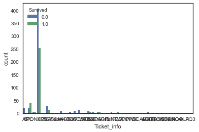


### Deal with Missing value: Embarked, Fair, Age 


```python
data['Embarked'] = data['Embarked'].fillna('S')
data.info()
```

    <class 'pandas.core.frame.DataFrame'>
    RangeIndex: 1309 entries, 0 to 1308
    Data columns (total 18 columns):
    Age            1046 non-null float64
    Cabin          295 non-null object
    Embarked       1309 non-null int8
    Fare           1308 non-null float64
    Name           1309 non-null object
    Parch          1309 non-null int64
    PassengerId    1309 non-null int64
    Pclass         1309 non-null int8
    Sex            1309 non-null int8
    SibSp          1309 non-null int64
    Survived       891 non-null float64
    Ticket         1309 non-null object
    Family_Size    1309 non-null int64
    Name_Len       1309 non-null int64
    LastName       1309 non-null object
    Title          1309 non-null object
    Title2         1309 non-null object
    Ticket_info    1309 non-null object
    dtypes: float64(3), int64(5), int8(3), object(7)
    memory usage: 157.3+ KB


```python
data['Fare'] = data['Fare'].fillna(data['Fare'].mean())
data.info()
```

    <class 'pandas.core.frame.DataFrame'>
    RangeIndex: 1309 entries, 0 to 1308
    Data columns (total 18 columns):
    Age            1046 non-null float64
    Cabin          295 non-null object
    Embarked       1309 non-null int8
    Fare           1309 non-null float64
    Name           1309 non-null object
    Parch          1309 non-null int64
    PassengerId    1309 non-null int64
    Pclass         1309 non-null int8
    Sex            1309 non-null int8
    SibSp          1309 non-null int64
    Survived       891 non-null float64
    Ticket         1309 non-null object
    Family_Size    1309 non-null int64
    Name_Len       1309 non-null int64
    LastName       1309 non-null object
    Title          1309 non-null object
    Title2         1309 non-null object
    Ticket_info    1309 non-null object
    dtypes: float64(3), int64(5), int8(3), object(7)
    memory usage: 157.3+ KB


```python
data["Cabin"].head(5)
```


    0     NaN
    1     C85
    2     NaN
    3    C123
    4     NaN
    Name: Cabin, dtype: object


```python
data["Cabin"] = data['Cabin'].apply(lambda x : str(x)[0] if not pd.isnull(x) else 'NoCabin')
data["Cabin"].unique()
```


    array(['NoCabin', 'C', 'E', 'G', 'D', 'A', 'B', 'F', 'T'], dtype=object)


```python
sns.countplot(data['Cabin'], hue=data['Survived'])
```


    <matplotlib.axes._subplots.AxesSubplot at 0x1a1e545668>


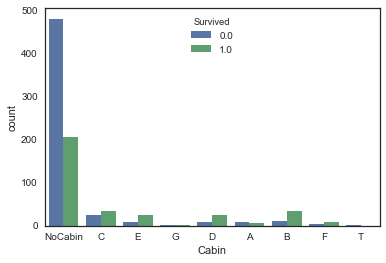


### Transform strings into numbers


```python
data['Sex'] = data['Sex'].astype('category').cat.codes
data['Embarked'] = data['Embarked'].astype('category').cat.codes
data['Pclass'] = data['Pclass'].astype('category').cat.codes
data['Title'] = data['Title'].astype('category').cat.codes
data['Title2'] = data['Title2'].astype('category').cat.codes
data['Cabin'] = data['Cabin'].astype('category').cat.codes
data['Ticket_info'] = data['Ticket_info'].astype('category').cat.codes
```


```python
dataAgeNull = data[data["Age"].isnull()]
dataAgeNotNull = data[data["Age"].notnull()]
```

## Choose people with higher fare and larger family size to predict data with Null age.
### According to the assumption above, these two factors refer to people with higher survival rate


```python
remove_outlier = dataAgeNotNull[(np.abs(dataAgeNotNull["Fare"]-dataAgeNotNull["Fare"].mean())>(4*dataAgeNotNull["Fare"].std()))|
                      (np.abs(dataAgeNotNull["Family_Size"]-dataAgeNotNull["Family_Size"].mean())>(4*dataAgeNotNull["Family_Size"].std()))                     
                     ]
tmp = ["Fare", "Family_Size"]
remove_outlier[tmp].head(5)
```


<div>
<style scoped>
    .dataframe tbody tr th:only-of-type {
        vertical-align: middle;
    }

    .dataframe tbody tr th {
        vertical-align: top;
    }

    .dataframe thead th {
        text-align: right;
    }
</style>
<table border="1" class="dataframe">
  <thead>
    <tr style="text-align: right;">
      <th></th>
      <th>Fare</th>
      <th>Family_Size</th>
    </tr>
  </thead>
  <tbody>
    <tr>
      <th>27</th>
      <td>263.0000</td>
      <td>5</td>
    </tr>
    <tr>
      <th>59</th>
      <td>46.9000</td>
      <td>7</td>
    </tr>
    <tr>
      <th>71</th>
      <td>46.9000</td>
      <td>7</td>
    </tr>
    <tr>
      <th>88</th>
      <td>263.0000</td>
      <td>5</td>
    </tr>
    <tr>
      <th>258</th>
      <td>512.3292</td>
      <td>0</td>
    </tr>
  </tbody>
</table>
</div>


### Predict age for Null value


```python
rfModel_age = RandomForestRegressor(n_estimators=2000,random_state=42)
ageColumns = ['Embarked', 'Fare', 'Pclass', 'Sex', 'Family_Size', 'Title', 'Title2','Cabin','Ticket_info']
X = remove_outlier[ageColumns]
Y = remove_outlier["Age"]
rfModel_age.fit(X, Y)
# predict & assign
ageNullValues = rfModel_age.predict(X= dataAgeNull[ageColumns])
dataAgeNull.loc[:,"Age"] = ageNullValues
```


```python
data = dataAgeNull.append(dataAgeNotNull)
data.reset_index(inplace=True, drop=True)
```


```python
dataTrain = data[pd.notnull(data['Survived'])].sort_values(by=["PassengerId"])
dataTest = data[~pd.notnull(data['Survived'])].sort_values(by=["PassengerId"])
dataTrain.columns
```


    Index(['Age', 'Cabin', 'Embarked', 'Fare', 'Name', 'Parch', 'PassengerId',
           'Pclass', 'Sex', 'SibSp', 'Survived', 'Ticket', 'Family_Size',
           'LastName', 'Title', 'Title2', 'Ticket_info'],
          dtype='object')


```python
dataTrain = dataTrain[['Survived', 'Age', 'Embarked', 'Fare',  'Pclass', 'Sex', 'Family_Size', 'Title2','Ticket_info','Cabin']]
dataTest = dataTest[['Age', 'Embarked', 'Fare', 'Pclass', 'Sex', 'Family_Size', 'Title2','Ticket_info','Cabin']]
```

### Modeling 


```python
lr = LogisticRegression()
svc = SVC()
knn = KNeighborsClassifier(n_neighbors = 3)
dt = DecisionTreeClassifier()
rf = RandomForestClassifier(criterion='gini', 
                             n_estimators=1000,
                             min_samples_split=12,
                             min_samples_leaf=1,
                             oob_score=True,
                             random_state=1,
                             n_jobs=-1)
gbdt = GradientBoostingClassifier(n_estimators=500,
                                  learning_rate=0.03,
                                  max_depth=3)
xgbGBDT = XGBClassifier(max_depth=3, 
                        n_estimators=300, 
                        learning_rate=0.05)
clfs = [lr, svc, knn, dt, rf, gbdt, xgbGBDT]

kfold = 10
cv_results = []
X_all = dataTrain.iloc[:, 1:]
Y_all = dataTrain.iloc[:, 0]
for classifier in clfs :
    cv_results.append(cross_val_score(classifier, X_all, y = Y_all, scoring = "accuracy", cv = kfold, n_jobs=4))
cv_means = []
cv_std = []
for cv_result in cv_results:
    cv_means.append(cv_result.mean())
    cv_std.append(cv_result.std())

cv_res = pd.DataFrame({"CrossValMeans":cv_means,"CrossValerrors": cv_std,
                       "Algorithm":["LR","SVC",'KNN','decision_tree',"random_forest","GBDT","xgbGBDT"]})

g = sns.barplot("CrossValMeans","Algorithm",data = cv_res, palette="Set3",orient = "h",**{'xerr':cv_std})
g.set_xlabel("Mean Accuracy")
g = g.set_title("Cross validation scores")
```


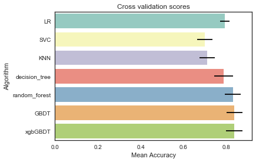


```python
rf = RandomForestClassifier(criterion='gini', 
                             n_estimators=1000,
                             min_samples_split=12,
                             min_samples_leaf=1,
                             oob_score=True,
                             random_state=1,
                             n_jobs=-1) 
rf.fit(dataTrain.iloc[:, 1:], dataTrain.iloc[:, 0])
print("%.4f" % rf.oob_score_)
```

    0.8294


```python
pd.concat((pd.DataFrame(dataTrain.iloc[:, 1:].columns, columns = ['variable']), 
           pd.DataFrame(rf.feature_importances_, columns = ['importance'])), 
          axis = 1).sort_values(by='importance', ascending = False)[:20]
```


<div>
<style scoped>
    .dataframe tbody tr th:only-of-type {
        vertical-align: middle;
    }

    .dataframe tbody tr th {
        vertical-align: top;
    }

    .dataframe thead th {
        text-align: right;
    }
</style>
<table border="1" class="dataframe">
  <thead>
    <tr style="text-align: right;">
      <th></th>
      <th>variable</th>
      <th>importance</th>
    </tr>
  </thead>
  <tbody>
    <tr>
      <th>4</th>
      <td>Sex</td>
      <td>0.265099</td>
    </tr>
    <tr>
      <th>2</th>
      <td>Fare</td>
      <td>0.163605</td>
    </tr>
    <tr>
      <th>6</th>
      <td>Title2</td>
      <td>0.152350</td>
    </tr>
    <tr>
      <th>0</th>
      <td>Age</td>
      <td>0.131825</td>
    </tr>
    <tr>
      <th>3</th>
      <td>Pclass</td>
      <td>0.091322</td>
    </tr>
    <tr>
      <th>5</th>
      <td>Family_Size</td>
      <td>0.071130</td>
    </tr>
    <tr>
      <th>8</th>
      <td>Cabin</td>
      <td>0.066924</td>
    </tr>
    <tr>
      <th>7</th>
      <td>Ticket_info</td>
      <td>0.031796</td>
    </tr>
    <tr>
      <th>1</th>
      <td>Embarked</td>
      <td>0.025949</td>
    </tr>
  </tbody>
</table>
</div>


```python
rf_res =  rf.predict(dataTest)
submit['Survived'] = rf_res
submit['Survived'] = submit['Survived'].astype(int)
submit.to_csv('submit.csv', index= False)
```


```python
submit.head(5)
```


<div>
<style scoped>
    .dataframe tbody tr th:only-of-type {
        vertical-align: middle;
    }

    .dataframe tbody tr th {
        vertical-align: top;
    }

    .dataframe thead th {
        text-align: right;
    }
</style>
<table border="1" class="dataframe">
  <thead>
    <tr style="text-align: right;">
      <th></th>
      <th>PassengerId</th>
      <th>Survived</th>
    </tr>
  </thead>
  <tbody>
    <tr>
      <th>0</th>
      <td>892</td>
      <td>0</td>
    </tr>
    <tr>
      <th>1</th>
      <td>893</td>
      <td>1</td>
    </tr>
    <tr>
      <th>2</th>
      <td>894</td>
      <td>0</td>
    </tr>
    <tr>
      <th>3</th>
      <td>895</td>
      <td>0</td>
    </tr>
    <tr>
      <th>4</th>
      <td>896</td>
      <td>1</td>
    </tr>
  </tbody>
</table>
</div>


# References
1. Manav Sehgal,"Titanic Data Science Solutions", https://www.kaggle.com/startupsci/titanic-data-science-solutions
2. Heads or Tails, "Pytanic",https://www.kaggle.com/headsortails/pytanic
